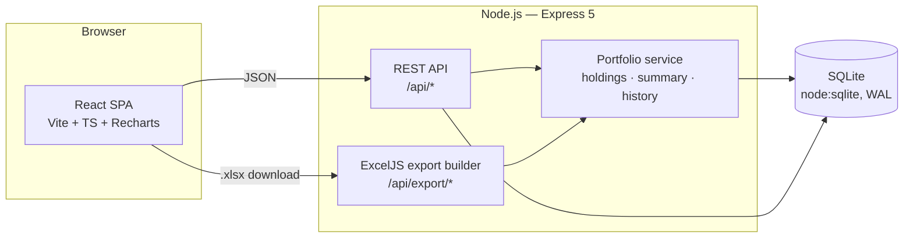

# Architecture & Implementation Plan

Design document for the Investment Portfolio Tracker — what is built, how it
fits together, and what comes next.

## Goals

1. Track purchases of **equity shares, mutual funds (lumpsum & SIP),
   government bonds, sovereign gold bonds** — each asset class shown
   separately, never mixed into one flat list.
2. Track **dividends and income** (equity dividends, MF IDCW payouts, bond
   coupons, SGB interest) on a dedicated page.
3. **Every section exportable to Excel** — per-page exports plus a single
   full-portfolio workbook.
4. Helpful visuals: growth vs. invested, allocation, per-class P&L, monthly
   income, per-instrument price history.

## System architecture



- **No native dependencies**: persistence uses Node's built-in `node:sqlite`,
  so the backend installs and runs anywhere Node 22+ does.
- **Single-process production**: the backend statically serves the built SPA
  with an SPA fallback, so deploy = `node src/server.js`.
- Holdings are **derived, never stored** — recomputed from the transaction
  ledger on each request (weighted-average cost basis), so edits and deletes
  can never leave stale aggregates.

## Data model

```mermaid
erDiagram
    INSTRUMENTS ||--o{ TRANSACTIONS : has
    INSTRUMENTS ||--o{ PRICES : "price history"
    INSTRUMENTS ||--o{ DIVIDENDS : "pays"
    INSTRUMENTS ||--o{ SIPS : "recurs via"
    SIPS ||--o{ TRANSACTIONS : "generates installments"

    INSTRUMENTS {
        int id PK
        text symbol UK
        text name
        text asset_class "EQUITY | MUTUAL_FUND | GOV_BOND | GOLD_BOND | OTHER"
        real coupon_rate "bonds/SGB"
        real face_value
        text maturity_date
    }
    TRANSACTIONS {
        int id PK
        int instrument_id FK
        text date
        text type "BUY | SELL"
        real quantity
        real price
        real charges
        text source "LUMPSUM | SIP"
        int sip_id FK
    }
    SIPS {
        int id PK
        int instrument_id FK
        real amount
        int day_of_month
        text start_date
        int active
    }
    DIVIDENDS {
        int id PK
        int instrument_id FK
        text date
        text type "DIVIDEND | COUPON | SGB_INTEREST | MF_PAYOUT | OTHER"
        real amount
    }
    PRICES {
        int instrument_id PK_FK
        text date PK
        real price
    }
```

Design decisions:

- **One `instruments` table for every asset class** with class-specific
  nullable columns (coupon, face value, maturity) instead of per-class tables —
  holdings math, exports and the transactions ledger stay uniform, while each
  page filters by `asset_class`.
- **SIP installments are ordinary BUY transactions** tagged `source='SIP'` and
  linked to their plan via `sip_id`. Holdings need no special SIP handling and
  a paused SIP simply stops generating rows.
- **Income is its own ledger** (`dividends`), typed by origin so the Dividends
  page can split equity dividends from coupons, IDCW payouts and SGB interest.
- **Prices are a date series** per instrument; valuations use the latest price
  on or before the date being valued, so history charts are consistent with
  backdated entries. Recording a transaction upserts a same-day price point so
  valuations reflect the trade immediately.

## Portfolio math

- **Holdings (weighted-average cost):** BUY adds `qty·price + charges` to cost
  basis; SELL removes `avg_cost·qty` from basis and books
  `proceeds − charges − avg_cost·qty` as realized P&L.
- **Summary:** holdings rolled up per asset class + grand total (invested,
  value, unrealized/realized P&L, income received).
- **History:** month-end grid; per date, replay the ledger for cumulative
  quantity/cost and value at the latest price ≤ date. One pass over
  transactions and price rows (pointer walk), so it stays O(tx + prices).

## Excel export

`GET /api/export/:kind` with `kind ∈ {portfolio, holdings, transactions,
dividends, sips}` (+ optional `asset_class`/`instrument_id` filters). Built
with ExcelJS: styled header rows, frozen panes, ₹ number formats, totals rows,
auto column widths. The `portfolio` kind emits one workbook with 8 sheets —
Summary, Equity, Mutual Funds, Government Bonds, Gold Bonds (SGB), SIPs,
Dividends & Income, Transactions.

## Frontend

| Page | Contents |
|---|---|
| Dashboard | KPI tiles, growth vs. invested (area+line), allocation donut, P&L-by-class bars, class summary, all holdings |
| Equity | Class KPIs, holdings, per-stock price history, buy/sell form |
| Mutual Funds & SIP | Class KPIs, holdings, NAV history, **SIP manager** (start/pause/record installment), buy/sell form |
| Government Bonds | Coupon & maturity columns, price history, coupon income tile |
| Gold Bonds (SGB) | Grams held, issue vs. market price, 2.5% interest income |
| Dividends & Income | Income KPIs, monthly stacked chart, fiscal-year totals, top sources, income entry, filterable records |
| Transactions | Full ledger with class filter, delete, add form |

Charting follows a validated design system: fixed categorical slots per asset
class (Equity=blue, MF=aqua, Govt=yellow, SGB=green — CVD-checked in both
themes), income types wear their asset class hue, single-hue emphasis for
value-vs-invested, thin marks, hairline grids, tooltips everywhere, tables as
the accessible twin of every chart, and automatic light/dark theming.

## Roadmap

1. **Live prices** — pluggable price providers: NSE/BSE quotes for equity,
   AMFI NAV feed for mutual funds, RBI/IBJA gold price for SGB; scheduled
   fetch into the `prices` table (the schema already supports it).
2. **XIRR** per instrument/class/portfolio (cash-flow based returns).
3. **Corporate actions** — splits, bonuses, mergers adjusting quantity/cost.
4. **Capital gains report** — FIFO lots, STCG/LTCG split, grandfathering; as an
   Excel export for tax filing.
5. **Multi-user + auth** (JWT), watchlists, and price alerts.
6. **Import** — broker contract notes / CAS (CAMS/KFintech) statement parsing.
